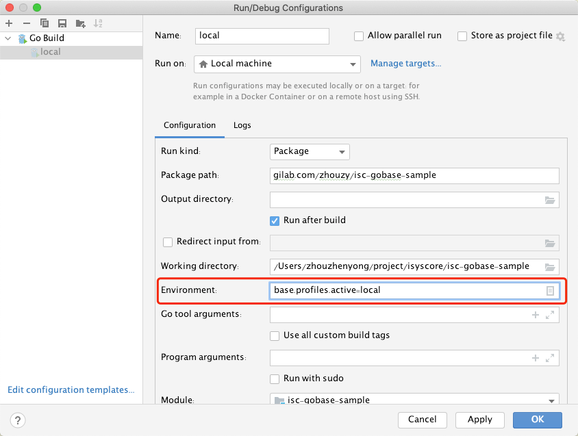

## config包
config包主要用于加载和管理项目中配置文件中的内容，配置文件为"application"开头的格式

### 1. 配置文件路径
默认该文件与main函数所在的类同目录
```go
// 示例
- application.yml
- application-local.yml
```

### 2. 配置文件格式
支持yaml、yml、json、properties配置文件
优先级: json > properties > yaml > yml

### 3. 支持profile加载不同配置文件
格式：application-{profile}.yyy
其中profile对应的变量为：base.profiles.active
变量的设置可以有如下
- 本地配置
- 环境变量配置

优先级：环境变量 > 本地配置



### 4. 内置的配置文件自动加载
目前内置的自动加载的配置文件有如下这些，后续随着工程越来越大会越来越多
```yaml
api-module: sample
base:
  api:
    # api前缀
    prefix: /api
  application:
    # 应用名称
    name: sample
  server:
    # 是否启用，默认：true
    enable: true
    # 端口号
    port: 8080
    # web框架gin的配置
    gin:
      # 有三种模式：debug/release/test
      mode: debug
  endpoint:
    # 健康检查处理，默认关闭，true/false
    health:
      enable: true
    # 配置的动态实时变更，默认关闭，true/false
    config:
      enable: true
```


### 5. 支持直接获取配置值
config包中提供了各种类型的api，方便实时获取
```go
// 基本类型
config.getValueInt("xxx.xxx")
config.getValueInt32("xxx.xxx")
config.getValueInt64("xxx.xxx")
config.getValueBool("xxx.xxx")
config.getValueString("xxx.xxx")
// ...

// 结构类型
config.getValueObject("xxx.xxx", &xxx)
```
示例：
```go
var ServerCfg ServerConfig

// base前缀
type BaseConfig struct {
    Application AppApplication
    Data string
}

type AppApplication struct {
    Name string
}
```

```yaml
base:
  application:
    name: "xxx-local"
  data: "test"
```

```go
// 直接读取即可
config.getValueObject("base", &ServerCfg)
```

### 6. 支持文件的绝对和相对路径读取
配置路径默认是与main同目录，也支持绝对路径读取对应的配置，该api可以用于与运维同学约定的服务器路径位置
```go
// 相对路径
config.LoadConfigFromRelativePath(xx)

// 绝对路径
config.LoadConfigFromAbsPath(xx)
```

### 7. 支持配置的叠加，相对路径和绝对路径
在配置已经加载完毕后，需要对一些配置进行覆盖，比如运维这边有相关的需求时候
```go
// 相对路径
config.AppendConfigFromRelativePath(xx)

// 绝对路径
config.AppendConfigFromAbsPath(xx)
```

### 8. 支持自动读取cm文件
应用启动会默认读取/home/{base.application.name}/config/application-default.yml对应的内容并覆盖应用的配置中

### 9. 支持配置的在线查看以及实时变更

如下配置配置开启后，就可以在线查看应用的所有配置了
```yaml
base:
  endpoint:
    # 配置的动态实时变更，默认关闭
    config:
      enable: true/false
```

```shell
// 查看应用所有配置
curl http://localhost:xxx/{api-module}system/config/values

// 查看应用的某个配置
curl http://localhost:xxx/{api-module}system/config/value/{key}

// 修改应用的配置
curl -X PUT http://localhost:xxx/{api-module}system/config/update -d '{"key":"xxx", "value":"yyyy"}'
```

##### 注意
该配置的修改只对`config.getValueXXX()` 这种实时调用的配置有效，配置使用方式有两种
- 实体化：在对应文件中直接将配置实体化起来
- api实时调用：代码中使用时候直接调用config.getValueXXX()

其中动态变更只对api实时调用的方式有效
