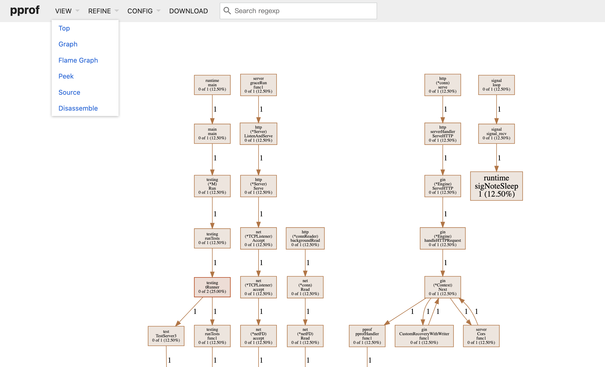

# 线上调试文档介绍
鉴于提供的一些调试工具比较分散，这里进行统一介绍。<br/>

- 动态修改日志级别
- 动态打印接口出入参
- 动态查看管理的bean
- 动态启用pprof

## 一、帮助手册
命令很多，提供帮助手册
```shell
curl http://localhost:xxx/{api-prefix}/{api-module}/debug/help
```

示例：<br/>
```json
{
  "-============================================================================================================================================================================================": "",
  "1.-【帮助】": "---------------------: curl http://localhost:8080/api/demo/debug/help",
  "2.-": "========================【日志】===========================================================================================================================================================",
  "2.1 动态修改日志": "-----------------: curl -X PUT http://localhost:8080/api/demo/config/update -d '{\"key\":\"base.logger.level\", \"value\":\"debug\"}'",
  "3.-": "===================【接口出入参】===========================================================================================================================================================",
  "3.1 指定url打印请求": "--------------: curl -X PUT http://localhost:8080/api/demo/config/update -d '{\"key\":\"base.server.request.print.include-uri[0]\", \"value\":\"/api/xx/xxx\"}'",
  "3.2 指定url不打印请求": "------------: curl -X PUT http://localhost:8080/api/demo/config/update -d '{\"key\":\"base.server.request.print.exclude-uri[0]\", \"value\":\"/api/xx/xxx\"}'",
  "3.3 指定url打印请求和响应": "---------: curl -X PUT http://localhost:8080/api/demo/config/update -d '{\"key\":\"base.server.response.print.include-uri[0]\", \"value\":\"/api/xx/xxx\"}'",
  "3.4 指定url不打印请求和响应": "-------: curl -X PUT http://localhost:8080/api/demo/config/update -d '{\"key\":\"base.server.response.print.exclude-uri[0]\", \"value\":\"/api/xx/xxx\"}'",
  "4.-": "===================【bean管理】============================================================================================================================================================",
  "4.1 获取注册的所有bean": "-----------: curl http://localhost:8080/api/demo/bean/name/all",
  "4.2 查询注册的bean": "--------------: curl http://localhost:8080/api/demo/bean/name/list/{name}",
  "4.3 查询bean的属性值": "-------------: curl -X POST http://localhost:8080/api/demo/bean/field/get' -d '{\"bean\": \"xx\", \"field\":\"xxx\"}'",
  "4.4 修改bean的属性值": "-------------: curl -X POST http://localhost:8080/api/demo/bean/field/set' -d '{\"bean\": \"xx\", \"field\": \"xxx\", \"value\": \"xxx\"}'",
  "4.5 调用bean的函数": "--------------: curl -X POST http://localhost:8080/api/demo/bean/fun/call' -d '{\"bean\": \"xx\", \"fun\": \"xxx\", \"parameter\": {\"p1\":\"xx\", \"p2\": \"xxx\"}}'",
  "5.-": "=====================【pprof】============================================================================================================================================================",
  "5.1 动态启用pprof": "---------------: curl -X PUT http://localhost:8080/api/demo/config/update -d '{\"key\":\"base.server.gin.pprof.enable\", \"value\":\"true\"}'",
  "6.-": "===================【配置处理】=============================================================================================================================================================",
  "6.1 服务所有配置": "----------------: curl http://localhost:8080/api/demo/config/values",
  "6.2 服务所有配置(yaml结构)": "-------: curl http://localhost:8080/api/demo/config/values/yaml",
  "6.3 服务某个配置": "----------------: curl http://localhost:8080/api/demo/config/value/{key}",
  "6.4 修改服务的配置": "--------------: curl -X PUT http://localhost:8080/api/demo/config/update -d '{\"key\":\"xxx\", \"value\":\"yyy\"}'",
  "===============================================================================================================================================================================================": ""
}
```

## 二、动态修改日志
在出现问题时候，希望开启debug日志，这里提供了动态修改的功能，如下
```shell
curl -X PUT http://localhost:xxx/{api-prefix}/{api-module}/config/update -d '{"key":"base.logger.level", "value":"debug"}'
```

提示：<br/>
目前日志级别粒度比较粗，比如修改了级别为debug后，则大于等于debug的级别都会打印，粒度还是比较粗，建议后续增加日志分组概念


## 三、接口动态打印
在出现问题时候如何确定接口是否正常，要开启请求和响应的话，就方便多了，这里提供了该功能

### 指定uri
如果不指定uri则会默认打印所有的请求
```shell
# 指定要打印的请求的uri
curl -X PUT http://localhost:xxx/{api-prefix}/{api-module}/config/update -d '{"key":"base.server.request.print.include-uri[0]", "value":"/api/xx/xxx"}'
# 指定不要打印的请求uri
curl -X PUT http://localhost:xxx/{api-prefix}/{api-module}/config/update -d '{"key":"base.server.request.print.exclude-uri[0]", "value":"/api/xx/xxx"}'

# 指定要打印的响应的uri
curl -X PUT http://localhost:xxx/{api-prefix}/{api-module}/config/update -d '{"key":"base.server.response.print.include-uri[0]", "value":"/api/xx/xxx"}'
# 指定不要打印的响应uri
curl -X PUT http://localhost:xxx/{api-prefix}/{api-module}/config/update -d '{"key":"base.server.response.print.exclude-uri[0]", "value":"/api/xx/xxx"}'
```

提示：<br/>
- 如果"请求"和"响应"都开启打印，则只会打印"响应"，因为响应中已经包括了"请求"
- 指定多个uri的话，如下，配置其实是按照properties的方式进行指定的
```shell
curl -X PUT http://localhost:xxx/{api-prefix}/{api-module}/config/update -d '{"key":"base.server.request.print.include-uri[0]", "value":"/api/xx/xxx"}'
curl -X PUT http://localhost:xxx/{api-prefix}/{api-module}/config/update -d '{"key":"base.server.request.print.include-uri[1]", "value":"/api/xx/xxy"}'
curl -X PUT http://localhost:xxx/{api-prefix}/{api-module}/config/update -d '{"key":"base.server.request.print.include-uri[2]", "value":"/api/xx/xxz"}'
...
```
### 开启打印
注意：开启打印的话，所有的接口都会打印，所以建议请先指定uri
```shell
# 开启请求的打印
curl -X PUT http://localhost:xxx/{api-prefix}/{api-module}/config/update -d '{"key":"base.server.request.print.enable", "value":"true"}'
# 开启响应的打印
curl -X PUT http://localhost:xxx/{api-prefix}/{api-module}/config/update -d '{"key":"base.server.request.print.enable", "value":"true"}'
# 开启异常的打印
curl -X PUT http://localhost:xxx/{api-prefix}/{api-module}/config/update -d '{"key":"base.server.exception.print.enable", "value":"true"}'
```
## 四、动态管理bean
在运行中如果出现问题，需要查看某个对象的属性和函数的时候，就可以使用该功能，进行动态的查看、修改对应属性，以及动态的执行对应的函数

### 注意：
要使用该功能，前提是要先将对象注册到bean管理里面才行，否则是查询不到的，目前还需要手动添加到bean包管理里面<br/>
示例：
```shell
  tt := TestEntity{Name: "hello", Age: 12}
  // 请使用指针
  bean.AddBean("test", &tt)
```

```shell
# 获取注册的所有bean
curl http://localhost:xxx/{api-prefix}/{api-module}/bean/name/all'
# 查询注册的某些bean 
curl http://localhost:xxx/{api-prefix}/{api-module}/bean/name/list/:name'
# 查询某个bean的属性值
curl -X POST http://localhost:xxx/{api-prefix}/{api-module}/bean/field/get' -d '{"bean": "xx", "field": "xxx"}'
# 修改某个bean的属性的值
curl -X PUT http://localhost:xxx/{api-prefix}/{api-module}/bean/field/set' -d '{"bean": "xx", "field": "xxx", "value": "xxx"}'
# 调用bean的某个函数
curl -X POST http://localhost:xxx/{api-prefix}/{api-module}/bean/fun/call' -d '{"bean": "xx", "fun": "xxx", "parameter": {"p1":"xx", "p2": "xxx"}}'
```

注意：<br/>
- 调用bean函数中，parameter的对应的map中的key只能是p1、p2、p3...这种表示的是第一个、第二个、第三个参数的值
- 调用bean函数中，参数值暂时只适用于基本结构，对于实体类或者map类的暂时不支持，后续可以考虑支持

## 五、动态启用pprof
在线上出现性能问题后，本地如果要排查则很有可能复现不了，如果可以直接在线上开启pprof功能的话，就非常好了，这里提供了动态开启pprof的功能
```shell
# 开启pprof
curl -X PUT http://localhost:xxx/{api-prefix}/{api-module}/config/update -d '{"key":"base.server.gin.pprof.enable", "value":"true"}'
```

注意：<br/>
启用pprof对业务性能会产生一定的影响，不过影响不大，对于正式业务不是长久之计，因此如果想要业务恢复过来，只有重启


### 示例：
然后就可以基于web端口xxx来使用pprof了，具体pprof用法这里不做介绍，这里举一个简单例子。开启开关后，我们执行如下pprof命令即可排查相关问题
```shell
# 其中18080是新开的一个网页端口用于在该端口内查看信息，默认30秒
go tool pprof -http=:18080 http://localhost:xxx/debug/pprof/goroutine
```
然后自动打开网页，如下

